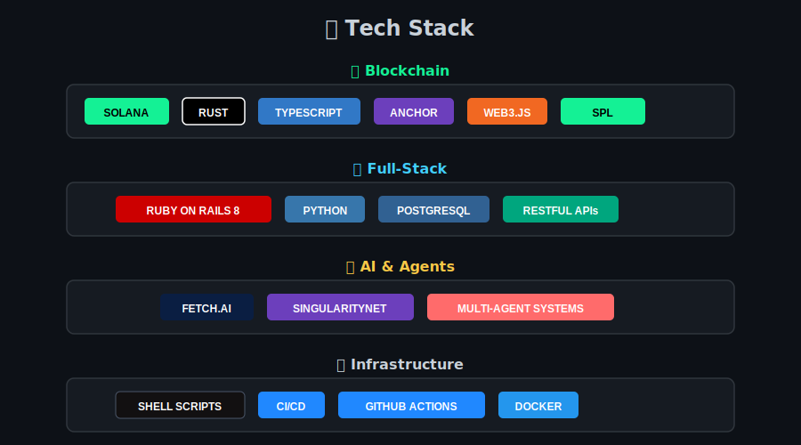

<div align="center">

```
██████╗ ███████╗ ██████╗████████╗ ██████╗ ██████╗     ██╗      █████╗ ██████╗ ███████╗
██╔══██╗██╔════╝██╔════╝╚══██╔══╝██╔═══██╗██╔══██╗    ██║     ██╔══██╗██╔══██╗██╔════╝
██████╔╝█████╗  ██║        ██║   ██║   ██║██████╔╝    ██║     ███████║██████╔╝███████╗
██╔══██╗██╔══╝  ██║        ██║   ██║   ██║██╔══██╗    ██║     ██╔══██║██╔══██╗╚════██║
██║  ██║███████╗╚██████╗   ██║   ╚██████╔╝██║  ██║    ███████╗██║  ██║██████╔╝███████║
╚═╝  ╚═╝╚══════╝ ╚═════╝   ╚═╝    ╚═════╝ ╚═╝  ╚═╝    ╚══════╝╚═╝  ╚═╝╚═════╝ ╚══════╝
```

### Building for Eternity | Blockchain Innovation from Indonesia

[](https://rectorspace.com)
[](https://solana.com)
[](https://en.wikipedia.org/wiki/Indonesia)

*Connecting minds, building blocks—with Ihsan, Amanah, and innovation.*

</div>

---

## 🎯 Mission

We build blockchain solutions that matter—for **dunya** (worldly excellence) and **akhirah** (eternal purpose).

**What we do:**
- 🚀 **Solana Innovation** - MEV democratization, DeFi tools, civic tech
- 🏆 **Active in Hackathons** - 8+ hackathons in 2025, pushing boundaries
- 🌏 **Indonesia-First** - Bridging Web3 with Southeast Asian needs
- 🕌 **Values-Driven** - Building with Islamic principles of excellence and responsibility

---

## 🌟 Featured Projects

<table>
<tr>
<td width="50%">

### 🏛️ [CORE](https://github.com/RECTOR-LABS/core)
**Rails 8 Monolith Platform**

The flagship platform powering rectorspace.com - built in one weekend with production-ready quality. A complete personal ecosystem with 7 sections: Homepage, Work, Labs, Journal, Cheatsheet, Dakwa, and Quran.

- ✅ **Status:** Live in production
- 🛠️ **Stack:** Ruby on Rails 8, Tailwind CSS v4
- 🚀 **Speed:** Built Nov 2-3, 2025
- 🎯 **Philosophy:** 100% working standard, Ihsan in every line

[🌐 Visit Live](https://rectorspace.com) • [📖 Read Story](https://rectorspace.com/work/core)

</td>
<td width="50%">

### ⚡ [MEVRebels Protocol](https://github.com/RECTOR-LABS/mevrebels-protocol)
**Democratizing MEV on Solana**

DAO-governed MEV profit sharing for Solana—built for the Superteam Cypherpunk Hackathon 2025. Transforming extractive MEV into community-owned infrastructure.

- 🏆 **Hackathon:** Superteam Cypherpunk 2025
- ⭐ **Stars:** 4
- 🛠️ **Stack:** TypeScript, Solana, Anchor
- 💡 **Impact:** Fair MEV distribution for all

[📦 View Repository](https://github.com/RECTOR-LABS/mevrebels-protocol)

</td>
</tr>
<tr>
<td width="50%">

### 🎟️ [Web3 Deal Discovery](https://github.com/RECTOR-LABS/web3-deal-discovery-nft-coupons)
**Reimagining Groupon with NFTs**

Tradable coupon NFTs on Solana—creating a secondary market for local deals. Coupons become liquid assets you can buy, sell, and trade.

- ⭐ **Stars:** 2
- 🛠️ **Stack:** TypeScript, Solana, NFT Standards
- 💡 **Innovation:** Coupons as tradable assets
- 🌏 **Use Case:** Local businesses + Web3

[📦 View Repository](https://github.com/RECTOR-LABS/web3-deal-discovery-nft-coupons)

</td>
<td width="50%">

### 🏛️ [OpenBudget ID](https://github.com/RECTOR-LABS/openbudget-id)
**Government Transparency on Solana**

Real-time government spending analytics on-chain—bringing accountability to public finance in Indonesia. Civic tech for democratic financial oversight.

- 🏛️ **Category:** Civic Tech
- 🛠️ **Stack:** TypeScript, Solana
- 💡 **Purpose:** Democratic accountability
- 🇮🇩 **Focus:** Indonesia-first solution

[📦 View Repository](https://github.com/RECTOR-LABS/openbudget-id)

</td>
</tr>
<tr>
<td width="50%">

### 🤖 [ASI Agents Track](https://github.com/RECTOR-LABS/asi-agents-track)
**Multi-Agent AI Systems**

Intelligent multi-agent system leveraging Fetch.ai and SingularityNET—exploring autonomous AI collaboration for complex workflows.

- ⭐ **Stars:** 1
- 🛠️ **Stack:** Python, Fetch.ai, SingularityNET
- 🏆 **Hackathon:** ASI Agents Track
- 💡 **Tech:** Cutting-edge AI agents

[📦 View Repository](https://github.com/RECTOR-LABS/asi-agents-track)

</td>
<td width="50%">

### 🛠️ [recMEV Installer](https://github.com/RECTOR-LABS/recMEV-installer)
**Public Infrastructure Tool**

Automated installer for recMEV—making Solana DEX pool discovery accessible to everyone. Infrastructure tooling for the community.

- ⭐ **Stars:** 1
- 🛠️ **Stack:** Shell scripts, Rust backend
- 💡 **Type:** Infrastructure / DevOps
- 🎯 **Purpose:** Democratize MEV tooling

[📦 View Repository](https://github.com/RECTOR-LABS/recMEV-installer)

</td>
</tr>
</table>

[**→ View All 11 Projects**](https://github.com/orgs/RECTOR-LABS/repositories)

---

## 🛠️ Tech Stack

<div align="center">



</div>

---

## 🏆 Hackathon Track Record (2025)

| Hackathon | Project | Focus Area | Stars | Status |
|-----------|---------|------------|-------|--------|
| 🔐 **Superteam Cypherpunk** | MEVRebels Protocol | MEV Democracy | ⭐⭐⭐⭐ | 🏆 Featured |
| 🎟️ **Web3 Innovation** | Deal Discovery NFTs | NFT Coupons | ⭐⭐ | ✅ Complete |
| 🏛️ **OJK-Ekraf Infinity** | KaryaChain | Creative IP Rights | - | ✅ Complete |
| 🌍 **OpenGov Track** | OpenBudget ID | Civic Transparency | - | ✅ Complete |
| 🦅 **Garuda Spark** | KoperasiChain | MSME Cooperatives | - | ✅ Complete |
| 🌉 **Sanctum Gateway** | TX Analytics | Solana Dev Tools | - | ✅ Complete |
| 🤖 **ASI Agents** | Multi-agent System | AI Collaboration | ⭐ | ✅ Complete |
| 🛠️ **Nosana Builders 102** | DevFlow AI | Dev Assistant | - | ✅ Complete |

**📊 Stats:** 8 hackathons • 100% completion rate • Continuous innovation from Indonesia

---

## 🌏 Built in Indonesia 🇮🇩

We bring a unique perspective to blockchain development:

- 🏝️ **Southeast Asian Context** - Solving regional challenges with global standards
- 🕌 **Islamic Values** - Ihsan (excellence), Amanah (trust), avoiding waste
- 🌍 **Global Ambition** - Local roots, worldwide impact
- 🚀 **Rapid Execution** - From idea to production in days, not months

**Our Philosophy:** "Building for Eternity"—where technical excellence (dunya) meets purposeful impact (akhirah).

---

## 📚 Learn More

<div align="center">

| Resource | Description |
|----------|-------------|
| 🌐 **[rectorspace.com](https://rectorspace.com)** | Main platform and portfolio |
| 📖 **[Work Stories](https://rectorspace.com/work)** | Story-driven project narratives |
| 🐙 **[@rz1989s](https://github.com/rz1989s)** | Personal GitHub (35+ repos) |
| 🏛️ **[RECTOR-LABS](https://github.com/RECTOR-LABS)** | Organization (11 repos) |

</div>

---

## 🤝 Contributing

We welcome collaboration on projects that align with our mission of building excellent, purposeful technology.

### Values We Seek

- 💎 **Ihsan** - Striving for excellence and beauty in every line of code
- 🤝 **Amanah** - Treating code as sacred responsibility, not just a job
- 🚫 **No Israf** - Efficient, waste-free implementations without bloat
- 🌟 **Innovation** - Pushing boundaries with curiosity and courage
- 📚 **Learning** - Continuous improvement and knowledge sharing

### How to Contribute

1. ⭐ **Star** repositories you find valuable
2. 🐛 **Open issues** for bugs or feature ideas
3. 🔧 **Submit PRs** with clear, well-tested improvements
4. 💬 **Join discussions** on technical design and architecture
5. 📖 **Share** our work with communities who might benefit

### Contribution Guidelines

- All code must be production-ready (100% working standard)
- Follow existing patterns and conventions
- Write clear commit messages (conventional commits)
- Include tests for new features
- Document complex logic and decisions

---

## 🌟 Why RECTOR LABS?

**We're not just building projects—we're building for eternity.**

- 🎯 **Mission-Driven:** Every project serves a purpose beyond profit
- 🏆 **Battle-Tested:** 8 hackathons prove rapid execution under pressure
- 💡 **Innovation-First:** Exploring cutting-edge tech (MEV, AI agents, NFT utilities)
- 🌏 **Local Impact:** Solving Indonesia's challenges with global standards
- 🕌 **Values-Aligned:** Islamic principles of excellence woven into every commit

**Our track record speaks:**
- 🚀 Production apps built in 48 hours (CORE platform)
- 🏆 Multiple hackathon completions with innovative solutions
- ⭐ Growing community engagement across projects
- 🌍 Real-world applications in civic tech, DeFi, and AI

---

## 📬 Get in Touch

**Have an idea for collaboration?** We're open to:

- 🤝 Partnership opportunities on Solana projects
- 🏆 Hackathon collaborations and team formations
- 💼 Consulting on Rails or Solana architecture
- 🎓 Mentorship in Web3 development
- 🌏 Indonesia-focused blockchain initiatives

**Reach out:** Visit [rectorspace.com](https://rectorspace.com) or open a discussion in any repository.

---

<div align="center">

### Built with Bismillah 🕌

*In the name of Allah, the Most Gracious, the Most Merciful*

**May this work bring benefit to the Ummah and humanity. Aamiin.**

---

**RECTOR LABS** | Building for Eternity | 2025

[](https://github.com/RECTOR-LABS)
[](https://rectorspace.com)
[](https://indonesia.go.id)

*Ihsan • Amanah • Innovation*

</div>

